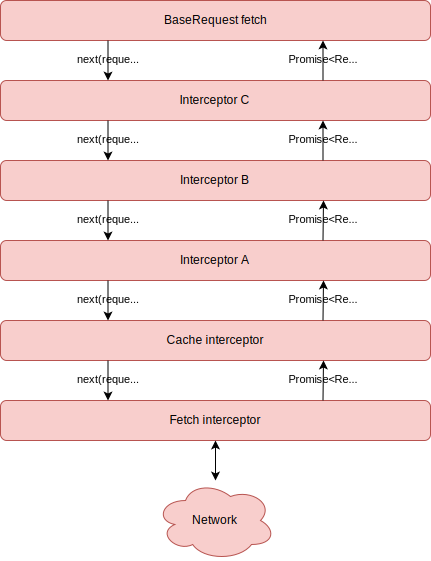

The library is using a concept of interceptors to handle use cases like authentication or other flows. This is conceptually similar to [Angular interceptors](https://angular.io/api/common/http/HttpInterceptor) or [Express middleware](https://expressjs.com/en/guide/using-middleware.html).

THe interceptors are responsible for most of the flow once the fetch method is called - including caching and doing the actual API request.

The interceptors receive the request object ([`IFetchOptions`](./typescript-ionterfaces#ifetchoptions)) and an optional `next` function representing the next interceptor in the chain. The return value of every interceptor should be a promise of the response object.

Only the bottom interceptor won't get the next function and that means that it will be responsible for making the actual API call.

## Call order

If we execute the following code:

```typescript
request
  .pipe(addInterceptor(interceptorA), addInterceptor(interceptorB), addInterceptor(interceptorC))
  .fetch();
```

the call stack will look like this:



Basically, the last added interceptor will be the first one called, and the last one getting the response back.

## Builtin interceptors

The library contains two builtin interceptors that try to make lib usage as simple as possible. However, in order to make things as flexible as possible, you can either completely remove or replace any of the interceptors with your implementation.

Bellow is the description of the builtin interceptors and what to do if you want to replace them.

**Note:** If you replace one of the builtin interceptors, make sure you don't use any of the operators mentioned bellow, as they will restore the original interceptor.

### Fetch

The fetch interceptor is responsible for making the request. It has three configurable options, each one can be modified by using one of the operators.

Options:

- fetch reference - this needs to be defined as `window.fetch` or any other compatible function, like the one from the `isomorphic-fetch` library. In the browser, the reference will be automatically set to `window.fetch` if it exists. If you're running the lib outside of the main browser process or the browser might not support the Fetch API, then you can set your own fetch implementation by using the [`fetchReference` operator](./operators#fetchreference).
- serializer - this function prepares the request body for the API call. This might be something like transforming a model snapshot to a format supported by the API. The function can be defined by using the [`serializer` operator](./operators#serializer)
- parser - this function prepares the API response for the [`Response`](./response) initialization. This might be e.g. because the response objects need to be modified or because the response is nested in a way that's not compatible with the `Response` class.

### Cache

The cache interceptor is responsible for caching of the network request. This implementation will cache only the `GET` requests. The interceptor supports two options described bellow, and they can be changed by using the [`cache` operator](./operators#cache).

Options:

- The default caching strategy in the browser is `CachingStrategy.CacheFirst` and on the server it's `CachingStrategy.NetworkOnly`.
- Besides the caching strategy, you can also set the `maxAge` value, which is a number of seconds a response will be cached for. The default maxAge is `Infinity`.

You can find more about the caching and configuration details on the [caching page](./caching).
